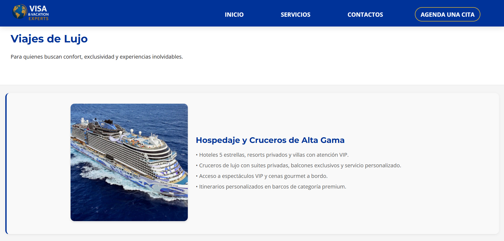
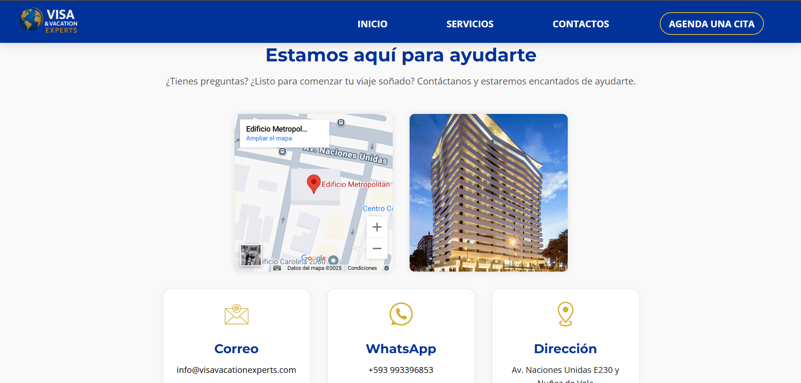
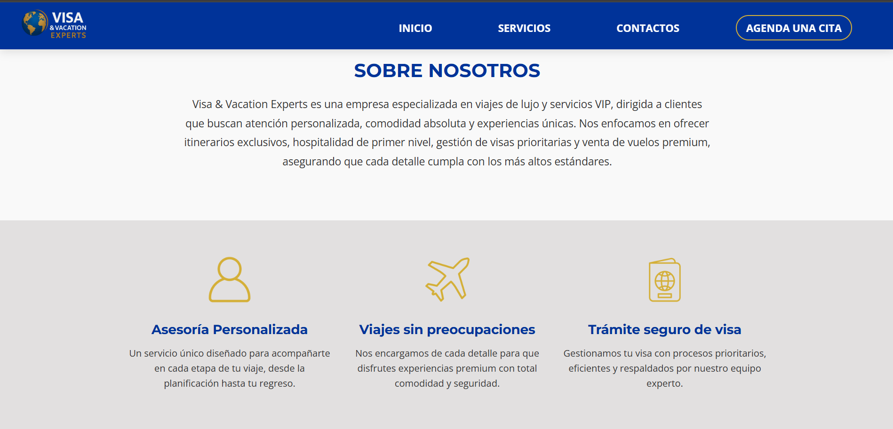

# 🌐 Static Websites – Showcase

This repository is a **general showcase** of several static websites I have developed using **HTML, CSS, and JavaScript**.  
These websites are simple, fast, and responsive, built without frameworks, focusing on clean design and functionality.

> 🔒 No source code is provided here.  
> 🌐 Live example: [Visa Vacation Experts](https://visavacationexpetrs.com/)

---

## ✨ Common Features
- **Home page** with a clear presentation.  
- **Services section** to describe offerings.  
- **Contact form** (basic form submissions / email integration).  
- **About us** page introducing the organization or purpose.  
- Fully responsive layouts for desktop and mobile.  
- Lightweight: pure HTML, CSS, and vanilla JavaScript.  

---

## 📸 Screenshots (generic examples)

  
  

  
  

---

## 🛠️ Tech Stack
- **HTML**  
- **CSS**  
- **JavaScript (vanilla)**  

---

## 🚀 Use Cases
These static websites are ideal for:
- Small businesses
- Landing pages
- Informational sites
- Quick prototypes

---

## 👤 Author
**Felipe Quirola** — Computer Science Engineering Student (7th semester, EPN)  
Freelancer · Web pages & mobile apps  
- 📧 [Email](mailto:fquirola2@gmail.com)

---

## 📝 License
This showcase is published under the **MIT License**. See [LICENSE](LICENSE).
